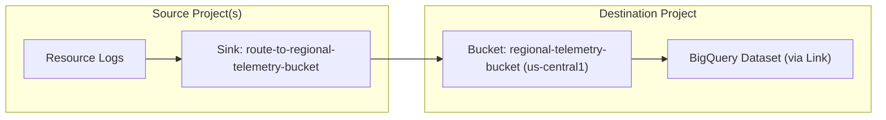
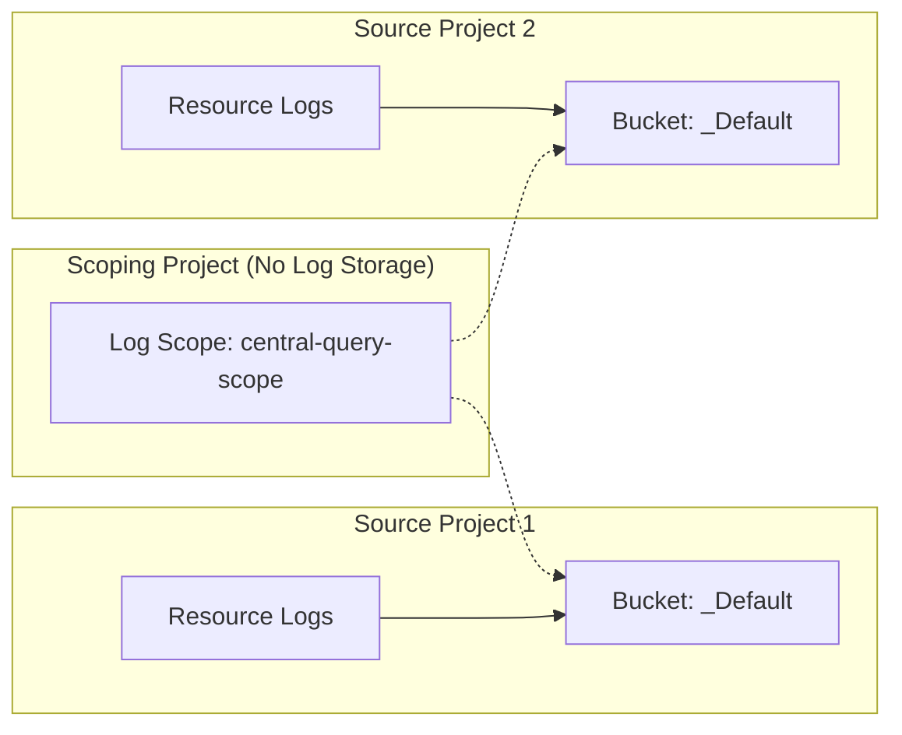

# Configuring Cross-Project Logging (Centralized vs. Read-Time)

This skill describes how to configure and verify cross-project logging structures
in Google Cloud Platform (GCP) using `gcloud` commands, covering both Centralized
Storage and Read-Time Aggregation approaches.

## Decision Matrix: Centralized vs. Read-Time Aggregation

Use this skill to configure **Centralized Storage** (routing logs to a central
bucket). If your requirements differ, consider **Read-Time Aggregation** (using
Observability Scopes) instead.

| Criterion             | Centralized Storage      | Read-Time Aggregation    |
:                       : (This Skill)             : (Observability Scopes)   :
| :-------------------- | :----------------------- | :----------------------- |
| **GCP Project Scale** | Scales to thousands of   | Best for < 375 projects. |
:                       : projects.                :                          :
| **Log Storage**       | Consolidated in a single | Resides in originating   |
:                       : central project.         : child projects.          :
| **SQL Analytics**     | Easy; unified querying   | Hard; requires querying  |
:                       : via Log Analytics        : multiple locations.      :
:                       : (BigQuery).              :                          :
| **Access Control**    | Scoped access via        | Requires IAM access to   |
:                       : central Log Views.       : all child projects.      :
| **Cost**              | Potential for            | Cost-effective; no data  |
:                       : duplication if           : replication.             :
:                       : exclusions aren't set.   :                          :

### Why We Chose Centralized Storage:

1.  **Unified SQL Analytics:** Essential for querying across all logs from a
    single surface using BigQuery SQL.
2.  **Centralized Access Control:** Allows managing access to logs in one place
    without granting permissions to all source projects.

## Architecture

### Centralized Storage (Log Routing)


### Read-Time Aggregation (Log Scopes)


## Setup Steps: Centralized Storage (Log Routing)

Use these steps to route logs from one or more source projects to a central bucket in a destination project.

### 1. Create regional log bucket in destination project
Create a custom log bucket with Log Analytics enabled (required for BigQuery integration).

> [!TIP] Prefer regional buckets (e.g., `us-central1`) over `global` to ensure compatibility with Log Analytics and SQL querying.

```bash
gcloud logging buckets create {bucket_id} \
    --project={destination_project_id} \
    --location={region} \
    --retention-days={retention_days} \
    --enable-analytics
```

### 2. Create log sink in source project
Create a project-level sink in the source project pointing to the destination bucket.

> [!IMPORTANT] **Gotcha:** Standard filter expressions like `logName:abc` can fail to match. **Always** use `LOG_ID("{log_id}")` for precise matching.

```bash
gcloud logging sinks create {sink_name} \
    logging.googleapis.com/projects/{destination_project_id}/locations/{region}/buckets/{bucket_id} \
    --project={source_project_id} \
    --log-filter='LOG_ID("{log_id}")'
```

### 3. Grant IAM permissions to sink writer
Retrieve the `writerIdentity` of the created sink and grant it `roles/logging.bucketWriter` on the destination project.

```bash
# Get the writer identity (service account)
gcloud logging sinks describe {sink_name} \
    --project={source_project_id} \
    --format="value(writerIdentity)"

# Grant permissions on the destination project
gcloud projects add-iam-policy-binding {destination_project_id} \
    --member={writer_identity} \
    --role=roles/logging.bucketWriter
```

---

## Setup Steps: Read-Time Aggregation (Log Scopes)

Use these steps to query logs across multiple projects without moving them, using Log Scopes.

### 1. Create a custom Log View (Optional but recommended)
Create a Log View in the source project to restrict which logs are accessible. 

> [!IMPORTANT] **Gotcha:** Log View filters are restricted. They can **only** contain restrictions on log source (`SOURCE()`), valid resource types (`resource.type`), or Log ID (`LOG_ID()`). You **cannot** filter by severity (e.g., `severity>=ERROR` is invalid inside a view filter; this must be done at query time).

```bash
gcloud logging views create {view_id} \
    --bucket={bucket_id} \
    --location={region} \
    --project={source_project_id} \
    --log-filter='LOG_ID("{log_id}")'
```
*   `{bucket_id}`: e.g., `_Default`
*   `{region}`: e.g., `global`
*   `{view_id}`: e.g., `app-logs-view`
*   If you want to allow access to all logs in the bucket, omit the `--log-filter` flag.

### 2. Create a Log Scope in the scoping project
Create a Log Scope in the central project (scoping project) listing the source resources (projects or specific log views).

```bash
gcloud logging scopes create {log_scope_id} \
    --project={scoping_project_id} \
    --resource-names={resource_names}
```
*   `{log_scope_id}`: e.g., `central-query-scope`
*   `{resource_names}`: Comma-separated list of resources (e.g., `projects/source-project-1,projects/source-project-2/locations/global/buckets/_Default/views/app-logs-view`). Max 50 projects, 100 resources total.

### 3. Update Default Observability Scope (Optional)
Link the Log Scope to the project's default observability scope so it is used by default in Logs Explorer.

```bash
gcloud observability scopes update Default \
    --project={scoping_project_id} \
    --location=global \
    --log-scope=//logging.googleapis.com/projects/{scoping_project_id}/locations/global/logScopes/{log_scope_id}
```

### 4. Grant IAM permissions to users
Unlike centralized routing, permissions are checked at query time. Users running queries must have:
*   `roles/logging.viewAccessor` granted on the specific Log View resource (with IAM conditions) or `roles/logging.viewer` on the source projects.
*   Access to the scoping project.

---

## Restricting Access to Sensitive Logs (Security)

If you have sensitive logs (e.g., security logs) in a source project's `_Default` bucket, anyone with `roles/logging.viewer` on that project can see them via the default `_Default` view. To restrict them:

### 1. Exclude from Default View (Keep logs, hide from general users)
Update the `_Default` view filter in the source project to explicitly exclude the sensitive logs:

```bash
gcloud logging views update _Default \
    --bucket=_Default \
    --location=global \
    --project={source_project_id} \
    --log-filter='NOT LOG_ID("cloudaudit.googleapis.com/data_access") AND NOT LOG_ID("externalaudit.googleapis.com/data_access") AND NOT LOG_ID("{sensitive_log_id}")'
```

### 2. Create a custom view for Security Team
Create a custom view (e.g., `security-view`) that includes the sensitive logs, and grant the security team `roles/logging.viewAccessor` restricted to that view using IAM conditions.

### 3. Exclude from Default Bucket (Discard logs)
If you want to completely prevent these logs from being stored in the `_Default` bucket:

> [!CAUTION] This will delete the logs immediately unless you have another sink routing them to a secure destination.

```bash
gcloud logging sinks update _Default \
    --project={source_project_id} \
    --add-exclusion=name=exclude-sensitive,filter='LOG_ID("{sensitive_log_id}")'
```

---

## Cost Optimization (Reducing Logging Costs)

Logging costs in GCP are based on the volume of data ingested and stored. You can significantly reduce costs by excluding high-volume, low-value logs or by sampling them.

> [!IMPORTANT]
> **Key Cost Considerations:**
> *   **Log Analytics Downgrade Limitation (Mandatory Warning):** Whenever providing guidance or commands on logging cost optimization or exclusions, you **must** proactively warn the user that once a log bucket has been upgraded to use Log Analytics, it **cannot be downgraded** to remove the analytics capability. Explain that if they want to stop incurring analytics costs, they must delete the bucket or route logs away from it.


### 1. Exclude high-volume logs entirely
To completely stop ingesting a specific type of log (e.g., Load Balancer logs or specific info logs) to the default bucket:

```bash
gcloud logging sinks update _Default \
    --project={project_id} \
    --add-exclusion=name=exclude-lb-logs,filter='resource.type="http_load_balancer"'
```

### 2. Sample high-volume logs (Keep a percentage)
If you need some logs for analysis but want to reduce volume, use the `sample()` function in the exclusion filter.

> [!IMPORTANT]
> The `sample(field, fraction)` function matches a `fraction` of logs. When used in an **exclusion filter**, the matched logs are **discarded**.
> Therefore, to **keep** a certain percentage of logs, you must **exclude** the remaining percentage.
> *   To **keep 10%** (exclude 90%), use `sample(insertId, 0.9)` in the exclusion filter.
> *   To **keep 25%** (exclude 75%), use `sample(insertId, 0.75)` in the exclusion filter.

To keep only 10% of `DEBUG` severity logs (excluding 90%):

```bash
gcloud logging sinks update _Default \
    --project={project_id} \
    --add-exclusion=name=sample-debug-logs,filter='severity=DEBUG AND sample(insertId, 0.9)'
```

--------------------------------------------------------------------------------

## Verification

### 1. Write test log in source project
```bash
gcloud logging write {log_id} "Test log message" --project={source_project_id}
```

### 2. Verify Centralized Storage (Read from destination bucket)
Verify the log arrived in the destination bucket. Note that you **must** specify the `--view` flag.

```bash
gcloud logging read 'LOG_ID("{log_id}")' \
    --bucket={bucket_id} \
    --location={region} \
    --project={destination_project_id} \
    --view=_AllLogs
```

### 3. Verify Read-Time Aggregation (Read from multiple resources)
Verify you can read logs using the scope or by specifying the resource names directly.

```bash
gcloud logging read 'LOG_ID("{log_id}")' \
    --resource-names=projects/{source_project_id}/locations/{region}/buckets/{bucket_id}/views/{view_id}
```

### 4. Query logs via BigQuery SQL (Optional, Centralized only)
If Log Analytics is enabled, you can link the bucket to BigQuery to query logs using SQL.

```bash
# Create a link (creates linked BQ dataset)
gcloud logging links create {link_id} \
    --bucket={bucket_id} \
    --location={region} \
    --project={destination_project_id}

# Query via bq CLI
bq query \
    --project_id={destination_project_id} \
    --use_legacy_sql=false \
    --location={region} \
    "SELECT log_id, text_payload, timestamp FROM \`{destination_project_id}.{link_id}._AllLogs\` WHERE log_id = '{log_id}'"
```

*   `{link_id}`: e.g., `bqlink` (use lowercase, alphanumeric, no hyphens)
